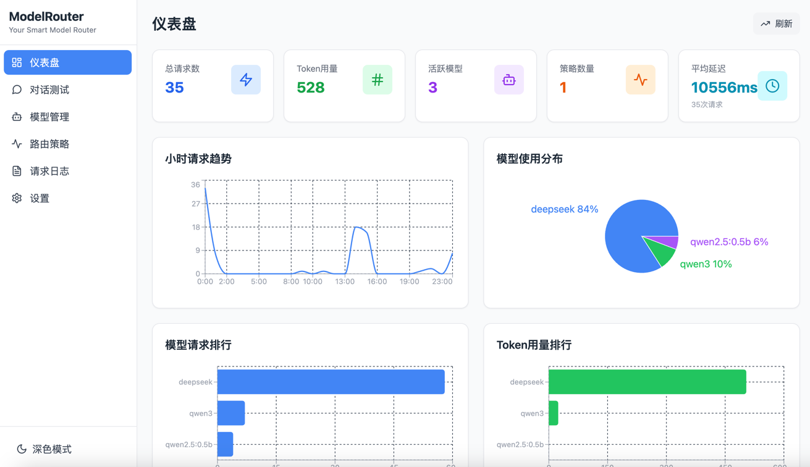

# ModelRouter

智能 AI 模型路由系统 - 根据问题复杂度自动选择最合适的 AI 模型



## 功能特性

- **智能路由**: 根据问题复杂度自动选择最合适的 AI 模型
- **多提供商支持**: 支持 OpenAI、DeepSeek、Ollama、Qwen、智谱AI、MiniMax、SiliconFlow 等
- **流式响应**: 支持流式输出，提升用户体验
- **实时统计**: 记录请求日志、Token 用量、延迟等统计数据
- **可视化仪表盘**: 直观展示模型使用情况
- **对话测试**: 内置对话测试界面

## 项目结构

```
ModelRouter/
├── server/                 # 后端服务
│   ├── src/
│   │   ├── index.js       # 主入口
│   │   ├── db.js          # 数据库操作
│   │   └── logger.js      # 日志模块
│   ├── data/              # 数据存储
│   │   ├── config.json    # 用户配置
│   │   ├── logs.json      # 请求日志
│   │   └── static.json    # 静态配置
│   └── package.json
│
├── desktop-ui/             # 前端界面
│   ├── src/
│   │   ├── pages/        # 页面组件
│   │   │   ├── Dashboard.js     # 仪表盘
│   │   │   ├── ChatTest.js      # 对话测试
│   │   │   ├── Models.js         # 模型管理
│   │   │   ├── ModelDetail.js   # 模型详情
│   │   │   ├── Strategies.js     # 路由策略
│   │   │   ├── StrategyDetail.js # 策略详情
│   │   │   ├── Logs.js           # 请求日志
│   │   │   └── Settings.js       # 设置
│   │   └── App.js
│   └── package.json
│
└── README.md
```

## 快速开始

### 前置要求

- Node.js >= 18
- npm >= 9

### 安装

```bash
# 安装后端依赖
cd server
npm install

# 安装前端依赖
cd ../desktop-ui
npm install
```

### 启动

```bash
# 终端1: 启动后端 (端口 8080)
cd server
npm start

# 终端2: 启动前端 (端口 3000)
cd desktop-ui
npm start
```

访问 http://localhost:3000

## 配置

### 1. 配置模型提供商

在「设置」页面配置 API Key：

- **SiliconFlow**: https://cloud.siliconflow.cn
- **DeepSeek**: https://platform.deepseek.com
- **OpenAI**: https://platform.openai.com
- **Ollama**: http://localhost:11434
- **Qwen**: https://dashscope.console.aliyun.com
- **智谱AI**: https://open.bigmodel.cn
- **MiniMax**: https://platform.minimax.io

### 2. 添加模型

在「模型管理」页面添加模型，选择提供商后会自动加载可用模型。

### 3. 配置路由策略

在「路由策略」页面创建策略，添加候选模型，设置选择规则。

## API

### OpenAI 兼容 API

```bash
# 流式请求
curl -X POST http://localhost:8080/v1/chat/completions \
  -H "Content-Type: application/json" \
  -d '{
    "messages": [{"role": "user", "content": "你好"}],
    "stream": true
  }'

# 非流式请求
curl -X POST http://localhost:8080/v1/chat/completions \
  -H "Content-Type: application/json" \
  -d '{
    "messages": [{"role": "user", "content": "你好"}]
  }'
```

### 配置 API

| 方法 | 路径 | 描述 |
|------|------|------|
| GET | `/api/config/models` | 获取模型列表 |
| POST | `/api/config/models` | 添加模型 |
| PUT | `/api/config/models/:id` | 更新模型 |
| DELETE | `/api/config/models/:id` | 删除模型 |
| GET | `/api/config/strategies` | 获取策略列表 |
| GET | `/api/config/logs` | 获取请求日志 |
| GET | `/api/config/settings` | 获取设置 |

## 技术栈

- **前端**: React + TailwindCSS + Recharts
- **后端**: Node.js + Express
- **数据存储**: JSON 文件

## License

MIT
